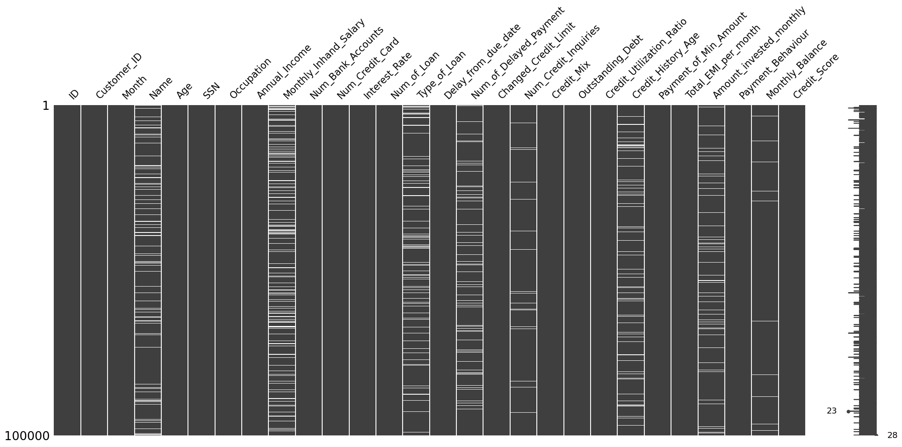
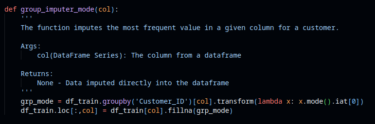
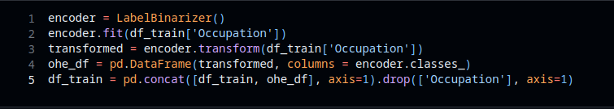
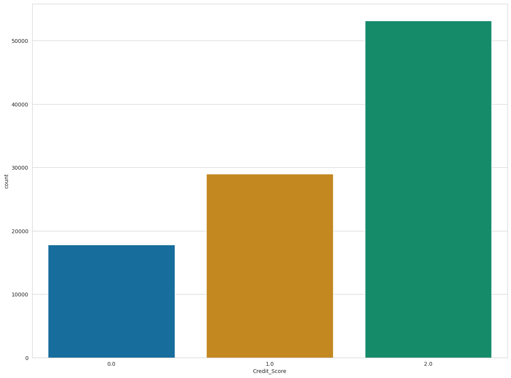
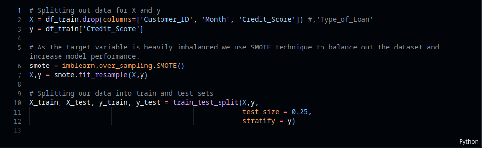
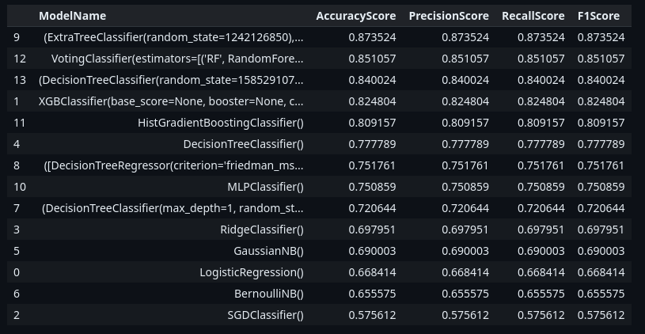
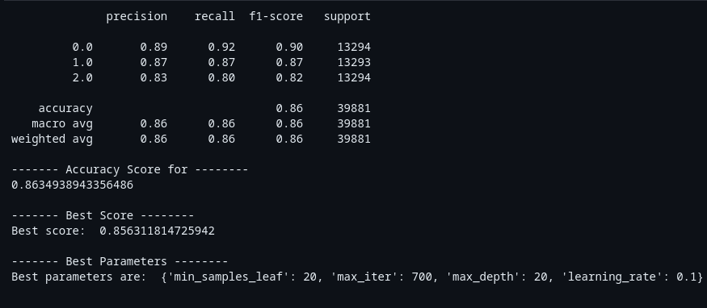
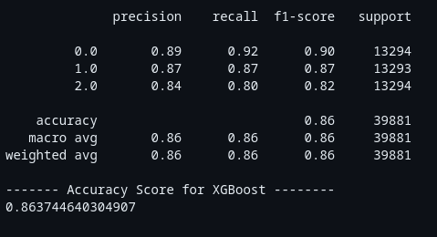

# Credit_Score_Classification

A credit classification model is a tool that is typically used in the decision-making process of determining ones credit score.  
The classification model is the result of a statistical model which, based on information about the borrower (e.g. Monthly Income, Number of Bank accounts/Credit cards, Outstanding debt etc.),   
allows one to distinguish between "good", "standard" and "bad" credit.   
A robust and accurate model can help to predict an individual credibility and eligibility for loans and other financial serives.


# Description

The objective of this project is to construct a multi-class classification model that can effectively forecast credit score categories with precision.

- The project begins by undertaking an Exploratory Data Analysis, which aims to examine and analyze the data in order to gain insights and understand the patterns and characteristics of the variables.

The data has the following properties

```
RangeIndex: 100000 entries, 0 to 99999
Data columns (total 28 columns):
 #   Column                    Non-Null Count   Dtype  
---  ------                    --------------   -----  
 0   ID                        100000 non-null  object 
 1   Customer_ID               100000 non-null  object 
 2   Month                     100000 non-null  object 
 3   Name                      90015 non-null   object 
 4   Age                       100000 non-null  object 
 5   SSN                       100000 non-null  object 
 6   Occupation                100000 non-null  object 
 7   Annual_Income             100000 non-null  object 
 8   Monthly_Inhand_Salary     84998 non-null   float64
 9   Num_Bank_Accounts         100000 non-null  int64  
 10  Num_Credit_Card           100000 non-null  int64  
 11  Interest_Rate             100000 non-null  int64  
 12  Num_of_Loan               100000 non-null  object 
 13  Type_of_Loan              88592 non-null   object 
 14  Delay_from_due_date       100000 non-null  int64  
 15  Num_of_Delayed_Payment    92998 non-null   object 
 16  Changed_Credit_Limit      100000 non-null  object 
 17  Num_Credit_Inquiries      98035 non-null   float64
 18  Credit_Mix                100000 non-null  object 
 19  Outstanding_Debt          100000 non-null  object 
 20  Credit_Utilization_Ratio  100000 non-null  float64
 21  Credit_History_Age        90970 non-null   object 
 22  Payment_of_Min_Amount     100000 non-null  object 
 23  Total_EMI_per_month       100000 non-null  float64
 24  Amount_invested_monthly   95521 non-null   object 
 25  Payment_Behaviour         100000 non-null  object 
 26  Monthly_Balance           98800 non-null   object 
 27  Credit_Score              100000 non-null  object 
```

The dataframe has numerous missing values as seen below



- Proceeding further involves data cleansing, where the objective is to eliminate redundant information, special characters, and NULL values. Additionally, it is essential to substitute any erroneous entries and fill in missing values by analyzing other relevant attributes or generating new data.In order to eliminate the need for guesswork, reverse engineering methods were utilized to derive the missing values from the ones that are already present.



For instance, the aforementioned function categorizes the customers based on their unique id and subsequently by the specified column (i.e., occupation). It imputes all the missing values for each customer individually assuming that their occupation hasn't changed during the period and preventing guessing or ambiguous data.

- The subsequent stage involves preprocessing the data, which entails transforming it to minimize high variance and skewness.

```
Age                         1.158726e+02
Annual_Income               1.213985e+09
Monthly_Inhand_Salary       1.015953e+07
Num_Bank_Accounts           6.725064e+00
Num_Credit_Card             4.273008e+00
Interest_Rate               7.641085e+01
Num_of_Loan                 5.984172e+00
Delay_from_due_date         1.568514e+02
Num_of_Delayed_Payment      3.531718e+01
Changed_Credit_Limit        3.931497e+01
Num_Credit_Inquiries        1.447767e+01
Outstanding_Debt            1.334324e+06
Credit_Utilization_Ratio    2.618241e+01
Total_EMI_per_month         6.386870e+03
Amount_invested_monthly     1.275073e+04
Monthly_Balance             1.821309e+04
dtype: float64
```
Additionally, the categorical variables are encoded using either one-hot encoding or ordinal encoding technique. 



- The target feature in the dataset exhibits a significant imbalance, which will be addressed in the subsequent phase.



 During this phase, we will prepare the dataset for modeling by dividing it into training and test sets.

 

- After completing the data preprocessing phase, the data is now prepared for modeling. Initially, several models are constructed using default parameters in the first stage, and their performance is recorded throughout the model building process.



- During the second stage of the model building process, hyperparameter tuning is conducted to enhance the performance of the model. Randomized search is employed in order to explore different hyperparameter combinations and potentially improve the model's performance. After the tuning process, multiple models demonstrated an improvement ranging from 4% to 6%. Ultimately, the two models that exhibited the best performance were selected and saved.

HistGradientBoost Classifier



XGBoost



# Libraries used

Tha main libraries used during the project are:

- pandas
- numpy
- matplotlib
- seaborn
- imblearn
- joblib
- scikit-learn

# File Structure

```
.
├── credit_score_classification.code-workspace
├── credit_score_classification.ipynb
├── environment.yml
├── final_model_xgb.sav
├── final_model_xtc.sav
├── model_report_scaled.txt
├── model_report_unscaled.txt
├── README.md
├── test.csv
└── train.csv
```